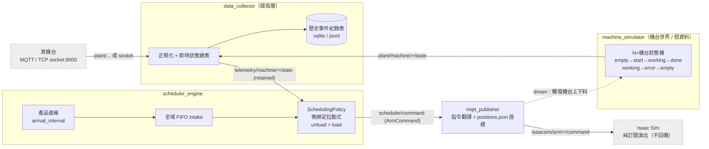
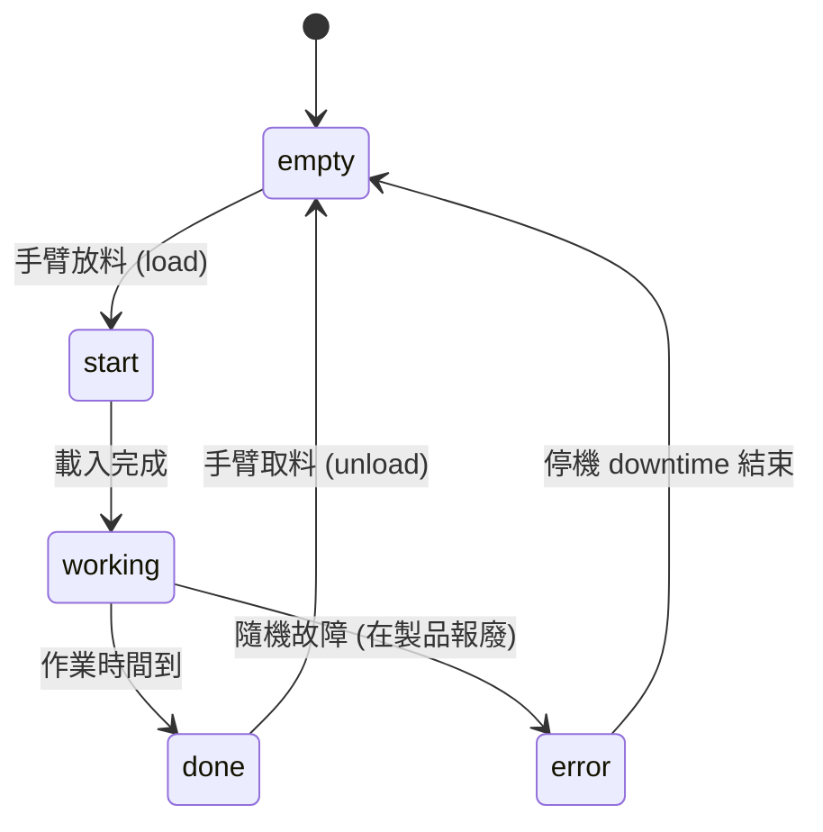

# Isaac Sim 機器手臂與機台排程資料模擬器

一個由 **simulator 全權驅動**的工廠排程模擬系統：模擬機台狀態與計時、執行排程演算法決定「哪個產品上哪台機台、由哪隻手臂搬運」，並透過 MQTT 把手臂搬運指令發給 **Isaac Sim 純演出**。Isaac Sim 不回傳任何資訊。

> 完整設計見 [docs/SPEC.md](docs/SPEC.md)（唯一事實來源）。想直接動手請看 [QUICKSTART.md](QUICKSTART.md)。

---

## 架構

四個解耦服務透過 MQTT broker (Mosquitto) 溝通，全部以 docker-compose 啟動；服務間**只靠 topic 溝通、不互相 import**，共用邏輯集中在 `libs/common`。



> 所有實線/虛線皆經 Mosquitto broker 以 MQTT topic 溝通（socket 來源除外）。虛線回到 machine_simulator 表示 `driven` 模式下機台訂閱手臂指令而反應——形成閉環：指令 → 機台動作 → 新狀態 telemetry → 排程下一步。

機台狀態機（SPEC §4）：



| 服務 | 職責 |
|---|---|
| **machine_simulator** | 每台機台一個狀態機，掌管 `empty→start→working→done` 與隨機 `error→downtime→empty`、即時計時。`autonomous` 自走（假資料）/ `driven` 由手臂指令驅動。 |
| **data_collector** | 統一擷取層：MQTT 與 TCP socket 兩來源走同一路徑 → 正規化、寫**歷史事件紀錄表** + **即時狀態總表**、republish 給排程。 |
| **scheduler_engine** | 純邏輯 `SchedulingPolicy`（晚綁定拉動式、`unload>load` 優先）+ `LiveDriver`（即時）/ `SimDriver`（容量試算）+ 解析公式容量試算。 |
| **mqtt_publisher** | 把排程的 `ArmCommand` 翻成 Isaac Sim 指令、解析 `positions.json` 固定座標。 |
| **broker** | Mosquitto，純訊息傳遞。 |
| **libs/common** | 共用：pydantic 訊息 schema、MQTT client、Clock（Real/Virtual）、EventSink（sqlite/jsonl）、config/logging。 |

---

## MQTT Topics

Broker：Mosquitto，`localhost:1883`（匿名）。`{id}` 隨 `config/simulation.json` 的機台/手臂數而定。

### 給 Isaac Sim（對外，訂 `isaacsim/#` 即全收）

| Topic | 內容 | retained |
|---|---|---|
| `isaacsim/arm/{arm_id}/command` | 手臂搬運指令（pick/place + 座標） | 否 |
| `isaacsim/machine/state` | **全部機台**狀態（單一 topic，payload 以 `{machine_id: {...}}` 聚合） | 是 |

目前設置（6 機台 + 1 手臂）的實際 topic：

```
isaacsim/arm/A1/command
isaacsim/machine/state        # 一包含 Tray_00~Tray_05
```

> 拼字是 `isaacsim`（i-s-a-a-c），別打成 `issacsim`。完整欄位與範例見 [docs/mqtt_format.md](docs/mqtt_format.md)。

### 內部（debug 用）

| Topic | 發佈者 → 訂閱者 | retained |
|---|---|---|
| `plant/machine/{id}/state` `/telemetry` | machine_simulator / 真機台 → data_collector | state=是 |
| `telemetry/machine/{id}/state` | data_collector → scheduler_engine | 是 |
| `scheduler/command` | scheduler_engine → mqtt_publisher | 否 |
| `scheduler/metrics` | scheduler_engine → (dashboard/log) | 否 |

真機台 socket 介面見 [docs/integration_real_machines.md](docs/integration_real_machines.md)；完整契約見 [docs/SPEC.md §6](docs/SPEC.md)。

---

## 核心設計重點

- **假資料 vs 真資料同介面**：「假資料」= `machine_simulator` 往 MQTT 發；「真資料」= 真機台走**相同** MQTT 或 TCP socket。`data_collector` 一視同仁，假↔真切換零程式改動。詳見 [docs/integration_real_machines.md](docs/integration_real_machines.md)。
- **排程是線上事件驅動派工**（非離線最佳化）：產品待在單一全域 FIFO intake、不預綁機台；手臂變空時拉取，`unload(done)` 優先於 `load`。對隨機故障天然強韌。
- **Policy/Driver/Clock 分層**：同一份 `SchedulingPolicy` 既跑即時 demo（`LiveDriver`+`RealClock`），也跑容量驗證（`SimDriver`+`VirtualClock`）——容量試算驗的就是要上線的邏輯。
- **狀態紀錄表**：MQTT retained = 即時狀態總表；append-only event log（sqlite/jsonl）= 歷史，所有指標與 replay 的依據。
- **開環**：Isaac Sim 不回傳，simulator 用設定的標稱動作時間推進。

機台狀態機：

```
empty ──load──▶ start ──▶ working ──done──▶ done ──unload──▶ empty
                            │
                            └──hazard──▶ error ──downtime──▶ empty   (在製品報廢)
```

---

## 進度

| 里程碑 | 內容 | 狀態 |
|---|---|---|
| M0 | 骨幹：libs/common、Mosquitto、docker-compose、服務互通 | ✅ |
| M1 | 機台狀態機+計時+故障；data_collector 落地紀錄表 | ✅ |
| M2 | 拉動式 SchedulingPolicy + LiveDriver 即時排程閉環 | ✅ |
| M3 | 容量試算：解析公式 + SimDriver/VirtualClock 模擬驗證 | ✅ |
| M4 | data_collector TCP socket gateway（真機台介面） | ✅ |
| M5 | Isaac Sim 對接：MQTT bridge 範本 + 座標規範 | ✅ 範本完成；對齊真實場景座標待使用者 Isaac 工作站 |

全部 28 個單元測試通過。

---

## 使用者可調參數（`config/simulation.json`）

| 參數 | 說明 |
|---|---|
| `machines.count` / `arms.count` | 機台數 / 手臂數 |
| `products.total` / `arrival_interval_s` / `arrival_jitter` | 產品總數 / 進線間隔 / 抖動(`poisson`\|`fixed`) |
| `process.machine_process_time_s` / `machine_load_time_s` | 機台作業時間 / 載入時間 |
| `arm.arm_move_time_s` / `arm_to_tray_time_s` | 上料時間(line→機台) / 下料時間(機台→盤)；load 與 unload 分別計時 |
| `error.error_prob_per_job` / `error_downtime_s` | 每件故障機率 / 停機時間 |
| `reachability_matrix` | 手臂→可達機台（分區 work-cell；不給則依 count 自動均分） |

`config/positions.json`：Isaac Sim 固定上下爪座標（見 [docs/positions_guide.md](docs/positions_guide.md)）。

---

## 快速指令

```bash
docker compose up -d --build         # 啟動全棧
docker compose logs -f scheduler_engine
docker compose down                  # 關閉

# 容量試算（不必起全棧）
docker compose run --rm scheduler_engine python capacity.py --config /app/config/simulation.json
```

更多步驟見 [QUICKSTART.md](QUICKSTART.md)。

## 測試

各服務皆有 pytest。**本機若非 Python 3.11+，請用容器跑**（套件要求 3.11）：

```bash
docker run --rm -v "$PWD":/app -w /app python:3.11-slim \
  bash -c "pip install -q ./libs/common pytest && \
           for s in machine_simulator data_collector scheduler_engine mqtt_publisher; do python -m pytest services/$s -q; done"
```

---

## 專案結構

```
config/        使用者參數 simulation.json / Isaac 座標 positions.json
broker/        Mosquitto 設定
libs/common/   共用套件 isaac_common（schemas/mqtt/clock/event_sink/config/logging/skeleton）
services/      machine_simulator / data_collector / scheduler_engine / mqtt_publisher
isaac_sim/     Isaac Sim 端 MQTT bridge 範本（mqtt_arm_bridge.py + controller 骨架）
docs/          SPEC.md / integration_real_machines.md / positions_guide.md
```

## 文件

- [docs/SPEC.md](docs/SPEC.md) — 完整規格（唯一事實來源）
- [QUICKSTART.md](QUICKSTART.md) — 5 分鐘上手
- [docs/integration_real_machines.md](docs/integration_real_machines.md) — 真機台接入（MQTT / socket）
- [docs/positions_guide.md](docs/positions_guide.md) — 座標規範
- [isaac_sim/README.md](isaac_sim/README.md) — Isaac Sim 端接線
- [CLAUDE.md](CLAUDE.md) — 開發守則
